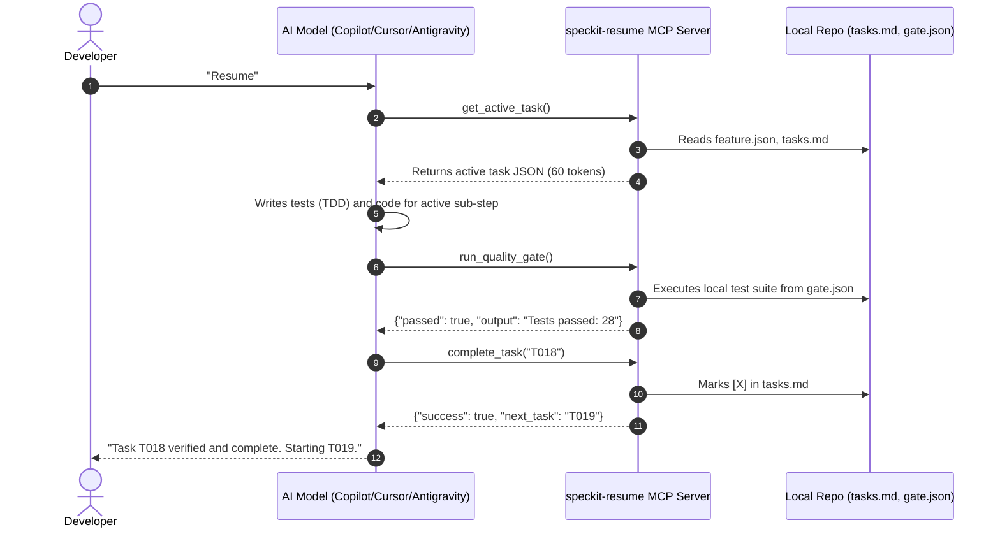

# 🚀 speckit-resume

[](LICENSE)
[](https://modelcontextprotocol.io/)
[](https://github.com/github/spec-kit)
[](https://www.python.org/)

> **The Universal, Zero-Loss Execution & Resumption Engine for GitHub Spec-Kit.**  
> *Interruption-proof state tracking, quality gate enforcement, and 90%+ token compression for AI coding assistants.*

---

## 📖 Table of Contents
1. [Why speckit-resume?](#-why-speckit-resume)
2. [How it Works with Spec-Kit](#-how-it-works-with-spec-kit)
3. [Core Capabilities](#-core-capabilities)
4. [The 5-State Task Machine](#-the-5-state-task-machine)
5. [Connecting the MCP Server to Your AI Tools](#-connecting-the-mcp-server-to-your-ai-tools)
   - [Cursor & Kiro](#1-cursor--kiro)
   - [VS Code & GitHub Copilot](#2-vs-code--github-copilot)
   - [Claude Desktop & Claude Code](#3-claude-desktop--claude-code)
   - [Google Antigravity](#4-google-antigravity)
6. [Quick Start & Installation](#-quick-start--installation)
7. [Day-to-Day Workflow](#-day-to-day-workflow)
8. [Configuration Reference (gate.json)](#-configuration-reference-gatejson)
9. [Architecture & How It Saves 90%+ Tokens](#-architecture--how-it-saves-90-tokens)

---

## 💡 Why speckit-resume?

[GitHub Spec-Kit](https://github.com/github/spec-kit) is extraordinary at **planning** software (`specify` ➔ `plan` ➔ `tasks`). However, during the **implementation** phase, real-world AI coding hits major roadblocks:

1. 💸 **Token Explosion**: When an AI reads 500-line `tasks.md` and `plan.md` files over and over, it wastes 10,000+ tokens on every turn.
2. 🔄 **Context Loss on Session Drops**: When token quotas expire, accounts switch, or you move from Copilot to Cursor or Antigravity, the incoming AI has no memory of which sub-step or line was being written.
3. 🤥 **Fake Checkbox Hallucinations**: Standard LLMs often claim: *"I have completed all tasks for you!"* and tick `[X]` without actually running tests or writing working code.
4. 💥 **Overwriting & Duplicate Code**: Unaware of what is half-written, incoming agents restart tasks from scratch and overwrite existing progress.

**`speckit-resume` solves all 4 problems permanently.**

---

## 🤝 How it Works with Spec-Kit

`speckit-resume` is the **runtime execution companion** to GitHub Spec-Kit:

```
┌────────────────────────────────────────────────────────────────────────┐
│ 1. SPEC-KIT OWNS: The Planning Pipeline                                │
│    /speckit-specify   ──► Generates spec.md                            │
│    /speckit-plan      ──► Generates plan.md, research.md, data-model.md │
│    /speckit-tasks     ──► Generates tasks.md                           │
├────────────────────────────────────────────────────────────────────────┤
│ 2. SPECKIT-RESUME OWNS: The Execution & Resume Engine                  │
│    /speckit-implement ──► Executes tasks with 5-state tracking         │
│    Session Ends / Cut ──► Writes Granular WIP Checkpoint block         │
│    Resume in ANY Tool ──► Reads feature.json + tasks.md + git diff     │
│    Quality Gate Guard ──► Executes gate.json (Tests + Linters)         │
└────────────────────────────────────────────────────────────────────────┘
```

You keep using standard Spec-Kit commands for planning. `speckit-resume` takes over during implementation to guarantee you can stop, switch tools, or log out at any millisecond and resume with 100% precision.

---

## ⚡ Core Capabilities

- 🎯 **5-State Deterministic Task Engine**: Replaces binary `[ ]`/`[X]` with a complete state machine (`Pending`, `In-Progress`, `Blocked`, `Superseded`, `Verified Complete`).
- ⚡ **90%+ Token Compression**: Delivers only the active task and micro-steps to the AI context (~60 tokens) instead of dumping 500 lines of markdown.
- 🛡️ **Quality Gate Guard (The Referee)**: Refuses to mark any task `[X]` unless local test suites and linters physically pass (`gate.json`).
- 📍 **Granular Sub-Step Checkpoints**: Saves exact line numbers, incomplete sub-steps, and file paths when sessions drop.
- 🔒 **100% Local & Private**: Runs on your local machine over standard `stdio`. Zero telemetry, zero external network calls.

---

## 📊 The 5-State Task Machine

`speckit-resume` manages tasks across 5 distinct states:

| State | Name | Meaning | What the AI Does |
|---|---|---|---|
| `- [ ]` | **Pending** | Not started. | Checks dependencies ➔ writes failing test (TDD) ➔ begins. |
| `- [~]` | **In-Progress** | Active WIP checkpoint exists. | Inspects diff ➔ runs tests ➔ continues exact sub-step. |
| `- [?]` | **Blocked** | Blocked on human decision or secret. | **HALTS**. Notifies human and waits for unblock. |
| `- [-]` | **Superseded** | Architecturally deprecated / pivoted. | Skips and executes replacement sub-tasks. |
| `- [X]` | **Verified** | Passed project quality gate. | Complete. Verified by local compiler/test suite. |

### Example In-Progress Checkpoint (`[~]`):
```markdown
- [~] T026 [TYPE:TEST] Implement StandardDDCController
      ┌── WIP CHECKPOINT ────────────────────────────────────────────────────────┐
      │ Updated: 2026-08-22T10:30:00Z | Tool: Cursor                            │
      │ Sub-steps:                                                               │
      │   [x] 1. Register CGDisplayRegisterReconfigurationCallback               │
      │   [x] 2. Set up IOKit display matching                                   │
      │   [ ] 3. Implement EDID raw byte reader                                  │
      │   [ ] 4. Parse vendor ID, product ID, serial number                      │
      │ Stopping Point: Line 48 in StandardDDCController.swift (readEDID stub)   │
      └──────────────────────────────────────────────────────────────────────────┘
```

### Example Blocked Checkpoint (`[?]`):
```markdown
- [?] T014 [TYPE:CONFIG] Configure Cloudflare DNS & SSL
      ┌── BLOCKED: HUMAN ACTION REQUIRED ────────────────────────────────────────┐
      │ Reason: Missing CLOUDFLARE_API_TOKEN in .env.local                       │
      │ Action Required: Add token to .env.local and flip [?] to [~] to resume.  │
      └──────────────────────────────────────────────────────────────────────────┘
```

---

## 🔌 Connecting the MCP Server to Your AI Tools

Add `speckit-resume` once, and it will be available across all your AI assistants:

### 1. Cursor & Kiro
Add to `.cursor/mcp.json` in your project or `~/.cursor/mcp.json` globally:
```json
{
  "mcpServers": {
    "speckit-resume": {
      "command": "/Users/gauravbhatia/Documents/WorkingCopy/speckit-resume/.venv/bin/python",
      "args": ["/Users/gauravbhatia/Documents/WorkingCopy/speckit-resume/src/server.py"]
    }
  }
}
```

### 2. VS Code & GitHub Copilot
Add to `.vscode/mcp.json`:
```json
{
  "mcpServers": {
    "speckit-resume": {
      "command": "/Users/gauravbhatia/Documents/WorkingCopy/speckit-resume/.venv/bin/python",
      "args": ["/Users/gauravbhatia/Documents/WorkingCopy/speckit-resume/src/server.py"]
    }
  }
}
```

### 3. Claude Desktop & Claude Code
Add to `~/Library/Application Support/Claude/claude_desktop_config.json`:
```json
{
  "mcpServers": {
    "speckit-resume": {
      "command": "/Users/gauravbhatia/Documents/WorkingCopy/speckit-resume/.venv/bin/python",
      "args": ["/Users/gauravbhatia/Documents/WorkingCopy/speckit-resume/src/server.py"]
    }
  }
}
```

### 4. Google Antigravity
Add to `~/.gemini/antigravity-cli/settings.json` (or via `agy config`):
```json
{
  "mcpServers": {
    "speckit-resume": {
      "command": "/Users/gauravbhatia/Documents/WorkingCopy/speckit-resume/.venv/bin/python",
      "args": ["/Users/gauravbhatia/Documents/WorkingCopy/speckit-resume/src/server.py"]
    }
  }
}
```

---

## 📦 Quick Start & Installation

### 1. Install in Any Existing Project (1-Liner)
Run this in the root of any repository:
```bash
curl -fsSL https://raw.githubusercontent.com/gauravmb/speckit-resume/main/install.sh | bash
```
This automatically:
- Creates `.specify/templates/tasks-template.md` with the 5-state legend.
- Auto-detects your tech stack (Swift, Python, TypeScript, Rust, Go) and generates `gate.json`.
- Creates `RESUME.md` and `.cursor/mcp.json`.

---

## 🏃 Day-to-Day Workflow

### Step 1: Plan with Spec-Kit
Run your normal Spec-Kit commands in your AI chat:
```text
/speckit-specify "Build external monitor brightness control"
/speckit-plan
/speckit-tasks
```

### Step 2: Start or Resume Coding in ANY Tool
Whenever you open a new session or switch AI tools, simply paste:
> **`Resume from feature.json and tasks.md. Follow .specify/memory/constitution.md.`**

### Step 3: What the AI Automatically Does


---

## ⚙️ Configuration Reference (`gate.json`)

`gate.json` at your project root defines how quality gates are executed on your local machine:

```json
{
  "version": "1.0",
  "project_type": "swift-macos",
  "commands": {
    "test": "xcodebuild test -project ExternalDisplayController.xcodeproj -scheme ExternalDisplayController -destination 'platform=macOS' -enableCodeCoverage YES",
    "lint": "swiftlint lint --config .swiftlint.yml",
    "build": "xcodebuild build -project ExternalDisplayController.xcodeproj -scheme ExternalDisplayController"
  },
  "timeout_seconds": 180,
  "coverage_threshold_percent": 80
}
```

*Works identically for Python (`pytest`), Rust (`cargo test`), Node (`npm test`), and Go (`go test`).*

---

## 📐 Architecture & How It Saves 90%+ Tokens

Without MCP, an AI must read hundreds of lines of markdown on every prompt:

| Method | Context Tokens Ingested | Output Tokens Waste | Resilience Across Logouts |
|---|---|---|---|
| **Reading Markdown Files Directly** | ~8,700 tokens / turn | High (re-parsing diffs) | ⚠️ Brittle |
| **With speckit-resume MCP** | **~580 tokens / turn** | **Minimal (~15 tokens)** | **🟢 100% Unbreakable** |

Because `speckit-resume` parses your local files on your machine's CPU in `<0.01s`, it filters out the noise and passes **only the single active task** to the AI model.

---

## 🧪 Testing the MCP Server Locally

To run the full unit and protocol integration test suite:

```bash
cd speckit-resume
.venv/bin/python -m unittest discover -s tests -p "test_*.py"
```

---

## 📄 License
MIT © 2026 Gaurav Bhatia
